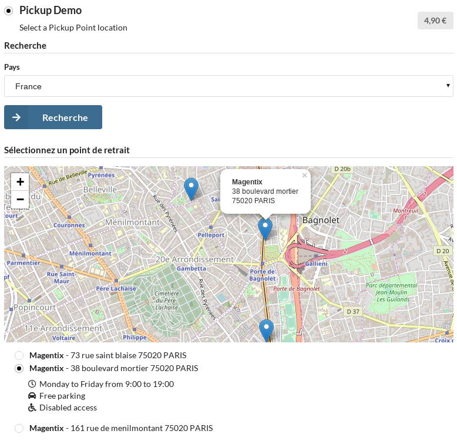

## Notes

* This Plugin allows to add pickup delivery method.

## Screenshot



## Installation

```bash
$ composer require magentix/sylius-pickup-demo-plugin
```

Add plugin dependencies to your `AppKernel.php` file:

```php
# app/AppKernel.php

public function registerBundles()
{
    $bundles = [
        ...
        new \Magentix\SyliusPickupPlugin\MagentixSyliusPickupPlugin(),
        new \Magentix\SyliusPickupDemoPlugin\MagentixSyliusPickupDemoPlugin(),
    ];
}
```

Import required config in your `app/config/config.yml` file:

```yaml
# app/config/config.yml

imports:
    ...
    - { resource: "@MagentixSyliusPickupPlugin/Resources/config/config.yml" }
    - { resource: "@MagentixSyliusPickupDemoPlugin/Resources/config/config.yml" }
```
    
Import routing in your `app/config/routing.yml` file:

```yaml
# app/config/routing.yml
...

magentix_pickup_plugin:
    resource: "@MagentixSyliusPickupPlugin/Resources/config/routing.yml"
```

Deploy Assets:

```bash
php bin/console sylius:theme:assets:install
```

## Configuration

In *Shipping Method* section from admin, add and configure new Method with *Demo Pickup* Calculator.